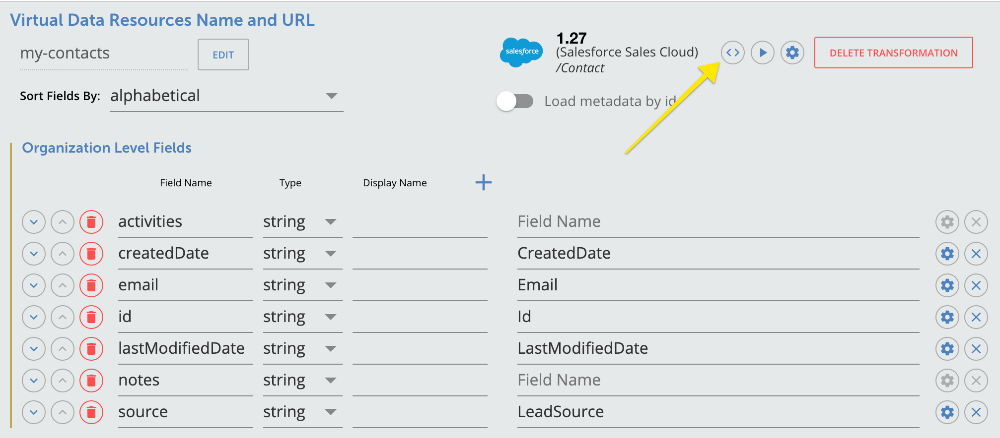

# Combine Multiple Objects in to a Single Virtual Data Resource (VDR)
This is an example for users familiar with Cloud Elements Virtual Data Resources to expand their resources to be able to combine data from one or more discrete objects into a single resource. In other words, instead of making a call to the `/contacts` endpoint, then making two calls for each contact to fetch their respective notes and activities, the requests can be combined in a single VDR.

## Terminology
* Parent VDR - VDR called from the consuming application (in this case a VDR called `my-contacts`)
* Child VDR - VDR or resource called via Javascript in the parent VDR, the response will be merged into the parent VDR's response (`my-contact-activities` and `my-contact-notes`).

Typically the parent VDR contains information needed to make the child API calls, such as an ID which is a reference to the object you would like to merge in the parent VDR.

## Things to note in this example
1. You can add the included [vdr.js](vdr.js) javascript file to any existing VDR (see the image below). 
    
  * You will need to change the fields to meet your needs. Some include:
    * `path`- can be changed depending on the resource you are calling
    * `ID` - used in the call to the child VDR
    * `field` - in the parent VDR to add the results
  * In our case we are calling a VDR named `my-contacts` then getting the notes and activities for each contact in the response.
2. Alternatively, you can authenticate an instance of Salesforce Sales Cloud, and import the parent and child VDRs provided in this repo. See below for instructions on show to import.

## Importing the VDR and transformation
There are two ways to import the VDRs and transformations. You can use the UI (API docs) or Cloud Element's cli tool, the doctor.

### Import in the UI
1. Create the VDRs.
    * Create the parent VDR by calling POST `/organizations/objects/my-contacts/definitions` with this payload: [objectDefinition.json](my-contacts/definition/objectDefinition.json), where the objectName is `my-contacts`. You can find this API [here](https://my-staging.cloudelements.io/api-docs/platform/organizations).
    * Create the child VDRs (`my-contact-activities` and `my-contact-notes`) using the same call as above, but switch out the objectName accordingly and use the following payloads:
      * objectName is `my-contact-activities`: [objectDefinition.json](my-contact-activities/definition/objectDefinition.json)
      * objectName is `my-contact-notes`: [objectDefinition.json](my-contact-notes/definition/objectDefinition.json)
2. Create the transformations for Salesforce.
    * Create the transformations for Salesforce by calling POST `/organizations/elements/sfdc/transformations/{objectName}` [here](https://my-staging.cloudelements.io/api-docs/platform/organizations), with the following payloads, where the keyOrId is always `sfdc` and the objectName changes accordingly.
      * objectName is `my-contacts`: [transformation.json](my-contacts/transformation/sfdc/transformation.json)
      * objectName is `my-contact-activities`: [transformation.json](my-contact-activities/transformation/sfdc/transformation.json)
      * objectName is `my-contact-notes`: [transformation.json](my-contact-notes/transformation/sfdc/transformation.json)
3. You can now move on to the section below, **Code Explanation**.

### Import using the doctor
1. Ensure you have the correct version of the doctor installed locally. Run the command:
    ```
    npm i -g ce-util
    ```
    This will install the latest, non-beta version of the doctor. You can find full instructions [here](https://www.npmjs.com/package/ce-util) as well, as you might need to add an account if you are not already familiar with the doctor. 
2. Import the VDRs and transformations.
    * In the terminal, cd into the `CombiningObjects` directory, then, from that directory, run the following three commands:
        ```
        doctor upload vdrs <accountNickName> -n my-contacts -d .
        ```

        ```
        doctor upload vdrs <accountNickName> -n my-contact-activities -d .
        ```

        ```
        doctor upload vdrs <accountNickName> -n my-contact-notes -d .
        ```
    * This will import the parent and child VDRs as well as the transformations and custom JS into the account you specify.
    * **Note**: If you make changes the the VDR and want to save them locally, you can run `doctor download vdrs <accountsNickName> -n nameOfVDRinUI -d .` from your terminal to do so. This command will save your VDR to a directory with the same name as your VDR. You can alternatively specify your own directory name instead of the `.` after the `d` flag.
3. You can now move on to the section below, [**Code Explanation**.

## Code Explanation
In the parent VDR (`my-contacts`), the JS will call the other two VDRs (`my-contact-activities` and `my-contact-notes`) and concatenate the results into one response. Make a `GET` request using the `Try It Out` feature in the VDR UI. You can cut and re-paste the JS as well to see how the returned results differ with and without it.

## Limitations with this approach
1. The Javascript will timeout after 30 seconds, use a smaller pageSize on the request.
2. Errors from the child API calls are returned in the response for the parent VDR, thus the consuming application will need to account for the case where one or all child API calls failed, but the parent API call was successful.
3. Be mindful of any concurrency limits of the provider's API.  